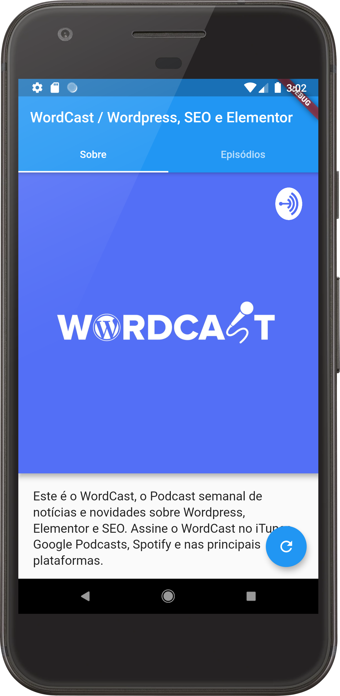
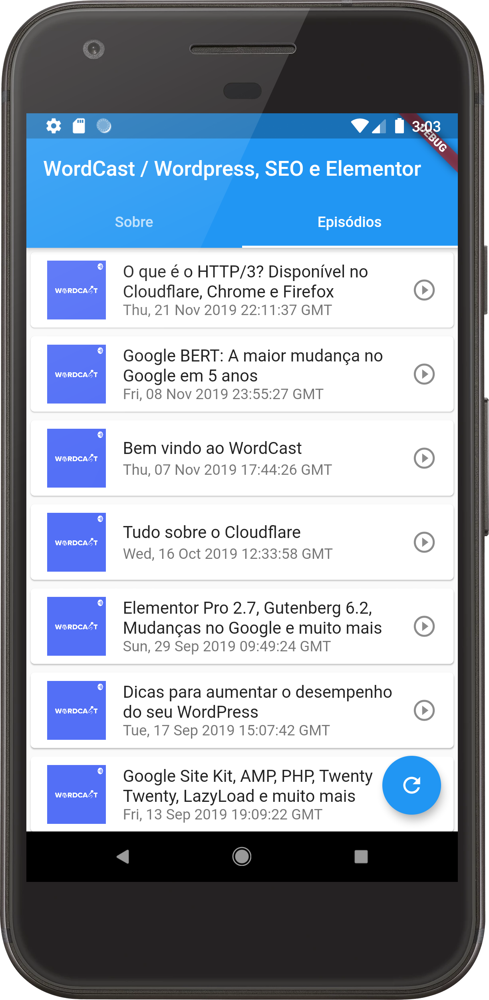
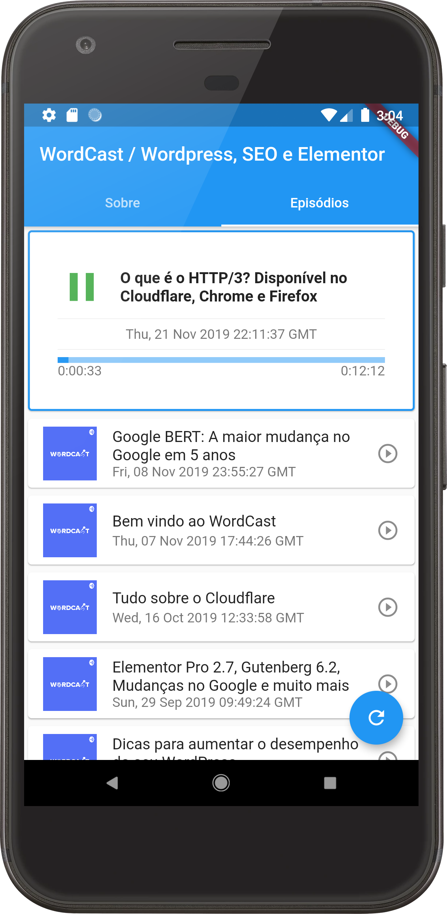
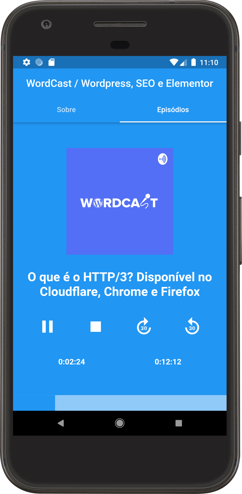

# flucast_app

A Open Source Podcast app for your Show

## Getting Started

Have you always wanted an exclusive app for your Podcast? Now you can customize and make available to your audience a player for Android and iOS developed with Flutter.

Simply configure your Podcast feed, tweak the app icon, build and make it available in stores.

## Main Features

FluCast has the most features that you need to play your show:

- Podcast Cover
- Podcast Description
- Episodes Listing
- Player Status
- Play, Pause and Stop
- 30 Seconds Seek
- Episode Description

## Screens
Home | Episodes | Playing | Details
---- | ---- | ---- | ----
 |   |   |  

## Dev Dependencies

- flutter_launcher_icons (https://pub.dev/packages/flutter_launcher_icons)
- dart_pod (https://pub.dev/packages/dart_pod)
- html (https://pub.dev/packages/html)
- audioplayer (https://pub.dev/packages/audioplayer)

## Resources

- app icon (https://www.flaticon.com/free-icon/record_1064911)